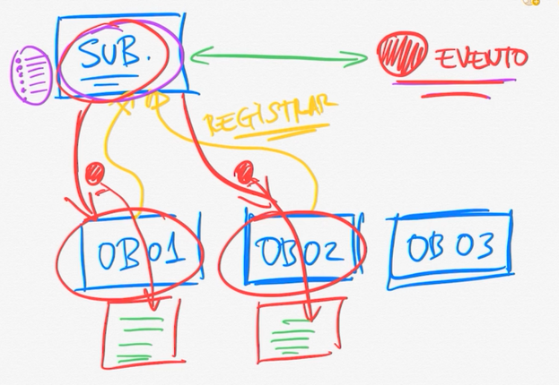

    
    <a href="https://twitter.com/Artaxerxes0001">
    • 
    
    </a> 
  

# Java Swing

## Padrão Observer
Nesse padrão temos elementos como o subject responsavel por detetar que um evento aconteceu, o observer que é o interessado por ser notificado quando o evento acontecer delegando a responsavelbilidade por detetar o evento ao subject.

Os observer devem se registrar ao subject para que seja notificado quando o evento acontecer. O evento pode ter informações como:
- quando aconteceu;
- quem disparou o evento;
- em que circustacia aconteceu ou o tipo de evneto;

#### Artaxerxes Nazareno

##### Sigam me:
   
